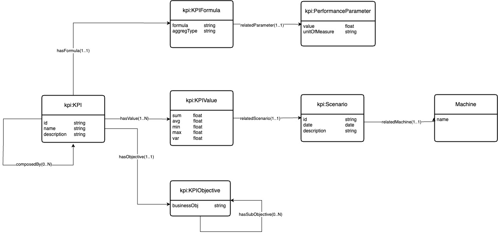

# KPI Ontology Document 

## Introduction
The **Key Performance Indicator Ontology** is designed to model metrics established at the onset of building renovation activities. Its primary goal is to monitor conformance with requirements typically associated with energy-efficient buildings. The ontology also conceptualizes the relationships between KPIs, projects, and scenarios, enabling structured tracking and analysis of performance relative to specific objectives and environmental contexts.

## Overview
The figure below presents an overview of the classes and the properties included in the KPI ontology.

## Dictionary

### `kpi:KPI`
    
A KPI (Key Performance Indicator) is a measurable metric used to evaluate the effectiveness of renovation activities in meeting energy efficiency and other project goals. It serves as the central entity that links calculation formulas, specific values, and business objectives.

   - **Attributes:**
     - `id` (string): A unique identifier for the KPI.
     - `name` (string): The name of the KPI, such as "Energy Consumption" or "CO₂ Emissions Reduction".
     - `description` (string): A detailed description explaining what the KPI measures and why it is important in the context of building renovation.

   - **Relationships:**
     - `hasFormula (1..1)`: Each KPI has a single formula that defines how its value is calculated, capturing how the KPI is measured or derived.
     - `hasValue (1..N)`: Each KPI can have multiple calculated values (`KPIValue`) for different scenarios or points in time, allowing for tracking over multiple contexts.
     - `hasObjective (1..1)`: Each KPI is linked to a single `KPIObjective`, representing the high-level business goal it supports.
     - `composedBy (0..N)`: A KPI can consist of multiple sub-KPIs, allowing for a hierarchical breakdown of performance indicators.

---

### `kpi:KPIFormula`
    
The formula or calculation method used to derive the KPI value. It defines the mathematical or logical expression for calculating the KPI, often using data from one or more performance parameters.

   - **Attributes:**
     - `formula` (string): The specific calculation or mathematical expression used to compute the KPI.
     - `aggregType` (string): The type of aggregation (e.g., sum, average) applied when combining values for the KPI.

   - **Relationships:**
     - `relatedParameter (1..1)`: Each `KPIFormula` is associated with exactly one `PerformanceParameter`, indicating the parameter that directly influences the calculation.

---

### `kpi:KPIValue`
    
A specific calculated value of a KPI for a given scenario, capturing performance data such as sum, average, minimum, maximum, and variance. `KPIValue` provides insights into the KPI’s behavior under different renovation project scenarios.

   - **Attributes:**
     - `sum` (float): The total sum of the KPI's values, often used for cumulative metrics.
     - `avg` (float): The average value, representing a central tendency of the KPI.
     - `min` (float): The minimum observed value for the KPI, indicating the lowest performance measurement.
     - `max` (float): The maximum observed value for the KPI, indicating peak performance.
     - `var` (float): The variance of the KPI values, showing the degree of variability in the measurements.

   - **Relationships:**
     - `relatedScenario (1..1)`: Each `KPIValue` is associated with a single `Scenario`, which describes the specific context or conditions in which the KPI was measured.

---

### `kpi:PerformanceParameter`
A measurable parameter related to a specific KPIFormula. Performance parameters serve as inputs to the KPI formulas, providing the necessary data for computation.

   - **Attributes:**
     - `value` (float): The measured numerical value of the performance parameter.
     - `unitOfMeasure` (string): The unit of measurement for the parameter (e.g., kWh, °C), ensuring consistency in calculations.

   - **Relationships:**  
     None specific to `PerformanceParameter`.

---

### `kpi:Scenario`
    
A specific context, situation, or period within the building renovation project in which KPIs are evaluated. Scenarios allow for assessing KPIs under different conditions.

   - **Attributes:**
     - `id` (string): A unique identifier for the `Scenario`.
     - `date` (date): The date or time period associated with the `Scenario`, indicating when the measurements were taken.
     - `description` (string): A description providing additional context or conditions specific to the scenario, such as "Summer Season Performance" or "Pre-Renovation Baseline".

   - **Relationships:**
     - `relatedMachine (1..1)`: Each `Scenario` is associated with one `Machine`, representing the system or equipment being evaluated in that scenario.

---

### `Machine`
    
A physical or virtual system on which KPIs are measured, such as HVAC units, lighting systems, or insulation materials. The machine entity allows for specifying the exact equipment being monitored in each scenario, supporting a detailed assessment of renovation impact on specific assets.

   - **Attributes:**
     - `name` (string): The name or identifier of the `Machine`, such as "Boiler System" or "Solar Panel Array".

   - **Relationships:**  
     None specific to `Machine`.

---

### `kpi:KPIObjective`
    
A high-level business objective related to building renovation, which the KPI is intended to measure progress towards. KPI objectives align with organizational goals for energy efficiency, cost savings, or environmental impact, providing strategic direction for tracking performance.

   - **Attributes:**
     - `businessObj` (string): The business objective or goal related to the KPI (e.g., "Reduce Energy Consumption by 20%", "Achieve Carbon Neutrality").

   - **Relationships:**
     - `hasSubObjective (0..N)`: A `KPIObjective` can have multiple sub-objectives, representing more specific goals that contribute to the overarching business objective.

---
	
